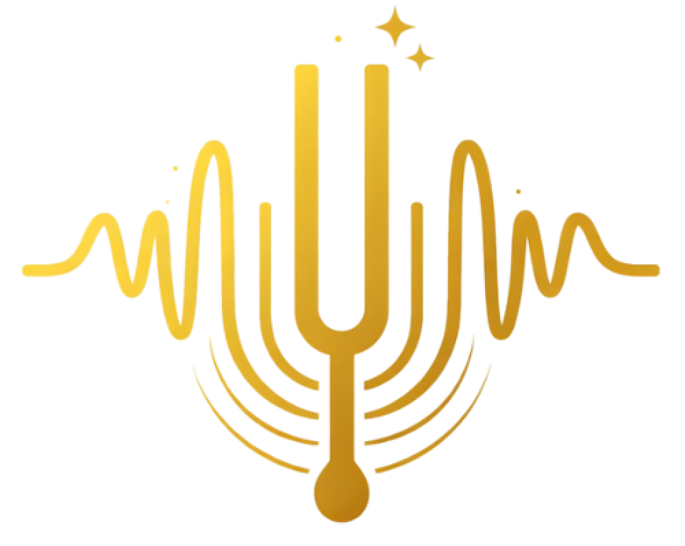

# SwarVeda  
### The Science of Indian Classical Music
### IKS Project by - Parnil Vyawahare, Raina George, Sasmit Narnaware, Mohammad Aamir Patloo

  

## Overview

**SwarVeda** is an educational web platform that explores the **scientific, mathematical, and acoustic foundations of Indian classical music**.  

The project demonstrates how concepts like **sound frequency, harmonic ratios, rhythm cycles, and melodic frameworks (ragas)** relate to both **music theory and physics**.

The goal of this project is to present Indian classical music not just as an art form, but also as a **structured knowledge system rooted in mathematics, acoustics, and traditional Indian knowledge systems (IKS).**

---

# Project Idea

The idea behind SwarVeda is to build an **interactive educational platform** that explains the scientific concepts behind Indian classical music.

Indian music theory contains structured knowledge related to:

- **Sound vibrations and frequencies**
- **Mathematical relationships between musical notes**
- **Rhythmic cycles (Taal)**
- **Melodic frameworks (Raga)**

This project combines **modern web technologies** with **traditional Indian music theory** to visually demonstrate these concepts.

---

# Pages and Features

## 1. Homepage

The homepage serves as the **entry point to the platform** and introduces the concept of SwarVeda.

### Purpose
- Provide an overview of the project
- Introduce Indian classical music and its scientific aspects
- Guide users to explore the different sections of the platform

### Key Features
- Project introduction
- Navigation to different modules
- Overview of sound, ragas, and rhythm systems

---

## 2. Science of Sound Page

This page explains the **physics behind sound and music**.

### Topics Covered
- What sound is and how it travels
- Sound waves and vibration
- Frequency and pitch
- Amplitude and loudness
- Harmonics and resonance

### Features
- Visual sound wave demonstrations
- Frequency examples
- Interactive explanations of sound concepts

---

## 3. Frequency Visualizer Page

This page demonstrates the **frequency relationships of the seven swaras (notes)** in Indian classical music.

### Features
- Interactive note selection
- Real-time audio tone generation
- Mathematical waveform visualization
- Scientific frequency calculation using **Just Intonation ratios**

### Implementation Highlights
- Base frequency defined as **Sa = 240 Hz**
- Other swaras derived using traditional ratios:

| Swara | Ratio |
|------|------|
| Sa | 1/1 |
| Re | 9/8 |
| Ga | 5/4 |
| Ma | 4/3 |
| Pa | 3/2 |
| Dha | 5/3 |
| Ni | 15/8 |
| Sa (High) | 2/1 |

Waveforms are rendered using the mathematical function: y = A sin(2πft)

where:
- **A** = amplitude  
- **f** = frequency  
- **t** = time  

---

## 4. Raga Explorer Page

The Raga Explorer introduces the **melodic frameworks of Indian classical music**.

### Features
- Interactive raga cards
- Explanation of raga structure
- Arohana and Avarohana patterns
- Vadi and Samvadi notes
- Emotional expression associated with ragas

This page helps users understand how ragas structure melody and musical expression.

---

## 5. Rhythm Labs Page

Rhythm Labs explores the **mathematics of rhythm (Taal)** in Indian classical music.

### Topics Covered
- Beat cycles
- Taal structure
- Rhythm counting patterns
- Mathematical rhythmic divisions

### Features
- Visual rhythm representations
- Interactive beat demonstrations
- Explanation of cyclic rhythmic patterns

---

# Connection to Indian Knowledge Systems (IKS)

Indian classical music is part of the broader **Indian Knowledge Systems (IKS)** tradition.

The project connects to IKS in several ways:

### 1. Scientific Understanding of Sound
Ancient Indian scholars studied sound as a **vibrational phenomenon**, reflected in concepts like **Nāda Brahma**, which describes the universe as vibration.

### 2. Mathematical Music Theory
Indian music uses precise **mathematical ratios** to define relationships between musical notes.

### 3. Structured Knowledge Frameworks
Systems like **Raga** and **Taal** demonstrate how musical knowledge was organized into structured frameworks.

### 4. Interdisciplinary Knowledge
Indian music theory integrates:
- mathematics
- physics
- philosophy
- aesthetics

SwarVeda demonstrates how these traditional knowledge systems can be explored using **modern technology and interactive learning tools**.

---

# Technologies Used

- React / TypeScript
- Web Audio API
- Canvas API
- Tailwind CSS
- Modern UI component architecture

---

# Team Members and Contributions

### Parnil Vyawahare
- Initial project setup
- Deployment
- Homepage implementation
- Frequency Visualizer page development
- Project management

---

### Raina George
- UI / UX design
- Raga Explorer page implementation
- Video explanation preparation

---

### Sasmit Narnaware
- Rhythm Labs page implementation

---

### Mohammad Aamir Patloo
- Science of Sound page implementation

---

# Conclusion

SwarVeda demonstrates how **ancient Indian musical knowledge systems** can be explored through **modern interactive technology**.  

By combining **music theory, physics, and mathematics**, the project highlights the depth of scientific understanding present in Indian classical traditions.
